# 🌟 Projeto Nosso Sonho 

## 📝 Descrição

Este projeto foi desenvolvido na disciplina Projetos 2 da [CESAR School](https://www.cesar.school/), em colaboração com a ONG [Instituto Solidare](https://institutosolidare.org.br/), uma organização que atua no apoio a crianças e jovens em situação de vulnerabilidade social.

Nosso objetivo é prototipar uma nova solução para o programa de apadrinhamento do Instituto Solidare, promovendo uma reformulação do sistema atual para torná-lo mais eficiente, acessível e alinhado às necessidades tanto da ONG quanto dos padrinhos e das crianças atendidas.

---

## 🌐 Google Site

> ❗ **Importante:** A maioria dos requisitos de C.C podem ser encontrados também no Google site na aba superior **Status Report**

https://sites.google.com/cesar.school/grupo6/home

---

## 👥 Equipe

- [**Mircio Ferreira**](https://github.com/Mircio-Ferreira) – [C.C]
- [**Gabriel Miranda**](https://github.com/GMiranda21ML) – [C.C]
- [**Ricardo Sergio**](https://github.com/whosricardo) – [C.C]
- [**André Avelino**](https://github.com/avelinoandre) – [C.C]
- [**Eric Gonçalve**](https://github.com/eric-albuquer) – [C.C]
- [**Thiago Fernandes**](https://github.com/ThIagoMedeiros21) – [C.C]
- [**Caio Mathews**](https://github.com/CaioMathews) – [C.C]
- [**Gabriel Aniceto**](https://github.com/gabrielaniceto1) – [C.C]
- [**João Passos**](https://github.com/iampassos) – [C.C]

- **Guilherme José** – [Designer]
- [**Rafael Lima**](https://www.linkedin.com/in/rafael-rocha-a89150361/?utm_source=share&utm_campaign=share_via&utm_content=profile&utm_medium=android_app) – [Designer]
- [**Gabriela Britto**](https://www.linkedin.com/in/gabriela-sampaio-98b587362) – [Designer]

---

## 🎓 Orientadores

- [**Manuela Beatriz**](https://www.linkedin.com/in/manucorreia/) – [Designer]
- **Eduardo Nascimento** – [C.C]
- [**Ana Carolina**](https://www.linkedin.com/in/carolmello--/) – [C.C]

---

## 🌐 Site no ar

https://projeto-2-gacghzg8cjg8e6a2.brazilsouth-01.azurewebsites.net/

### Super usuário (Usado para logar como AMD)

- **login:** institutoadmg6  
- **senha:** ADM%G6

---

## 📦 Tecnologias Utilizadas

---

## 📨 Entregas

<strong>📁 SR1 – Primeira Entrega</strong>

<strong>📜 Histórias de Usuário</strong>

<strong>📌 História 1 - Cadastro de Padrinho</strong>

**Como** um usuário interessado em participar do sistema de apadrinhamento,  
**Quero** me cadastrar,  
**Para** poder acessar a plataforma e iniciar minha jornada como padrinho.

#### 🎯 Cenário 1: Falha no Cadastro devido ao Erro no Preenchimento de Campos
- **Dado** que o usuário está fazendo o cadastramento e deixou um ou mais campos obrigatórios em branco,  
- **Quando** o usuário seleciona em "confirmar cadastro",  
- **Então** o sistema alerta que não pode seguir para a próxima etapa, pois o cadastro precisa estar totalmente preenchido.

#### ✅ Cenário 2: Sucesso na Visualização
- **Dado** que o usuário preencheu todos os campos obrigatórios corretamente,  
- **Quando** o usuário seleciona em "prosseguir",  
- **Então** o sistema deve registrar os dados do usuário,  
- **E** exibir uma mensagem de sucesso,  
- **E** redirecionar o usuário para a próxima etapa da plataforma.

<strong>📌 História 2 - Cadastro e Gerenciamento de Apadrinhados</strong>

**Como** administrador,  
**Quero** poder cadastrar e gerenciar apadrinhados,  
**Para** garantir que os dados dos apadrinhados sejam registrados e mantidos atualizados.

#### 🎯 Cenário 1: Falha no Cadastramento devido a Campos Não Preenchidos Corretamente
- **Dado** que o usuário preencheu os dados de cadastramento, mas não preencheu todos de forma correta,  
- **Quando** o usuário seleciona a opção "efetuar cadastramento",  
- **Então** o sistema alerta quais campos não foram cadastrados de forma correta e pede para que eles sejam preenchidos.

#### ✅ Cenário 2: Sucesso no Cadastramento de um Apadrinhado
- **Dado** que o usuário preencheu os dados de cadastramento corretamente,  
- **Quando** o usuário seleciona a opção "efetuar cadastramento",  
- **Então** o sistema alerta que o cadastramento foi efetuado com sucesso, demonstrando os dados cadastrados e exibindo se ele deseja cadastrar outro apadrinhado.

#### ❌ Cenário 3: Excluir Apadrinhado do Sistema
- **Dado** que o usuário está na página de gerenciar apadrinhados,  
- **Quando** o administrador seleciona o apadrinhado e clica em "apagar do sistema",  
- **Então** o sistema alerta se deseja prosseguir e, caso confirmado, o sistema deleta todos os dados do banco de dados.

<strong>🔄 Diagrama de Atividade</strong>

### História 1  
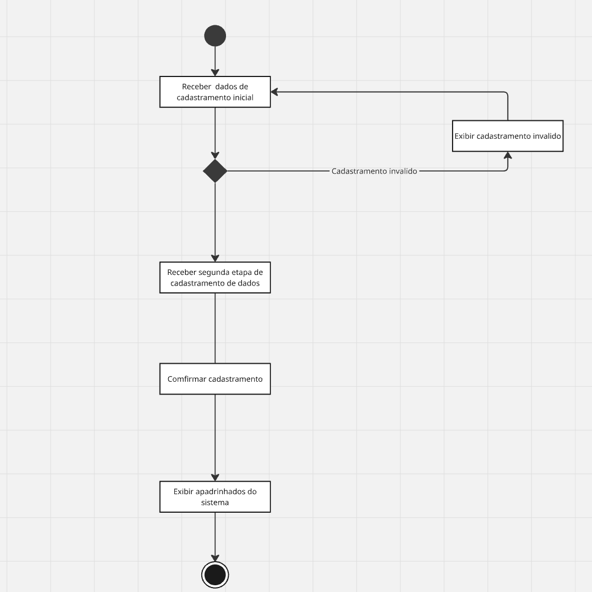

### História 2  
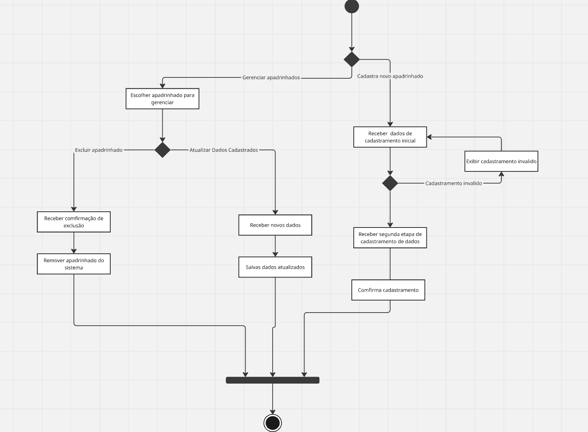

<strong>🖼️ Storyboards</strong>

- Link do docs com as Storyboards:  
  https://docs.google.com/document/d/150L9B3V2XvXIusJl3Vr5C6oQqQGo3yqRpPE7NPLYsRU/edit?usp=sharing

<strong>📝 Relatório de Programação</strong>

- Link do docs com o relatório de programação:  
  https://docs.google.com/document/d/1653YvO_WiZROmIwClfyujsrUe28AltAdsSxwCvJg4WQ/edit?tab=t.0

<strong>🚨 Issue / Bug Tracker</strong>

### Bug Open 1:
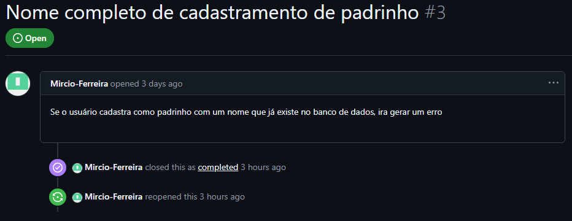

### Bug Open 2:
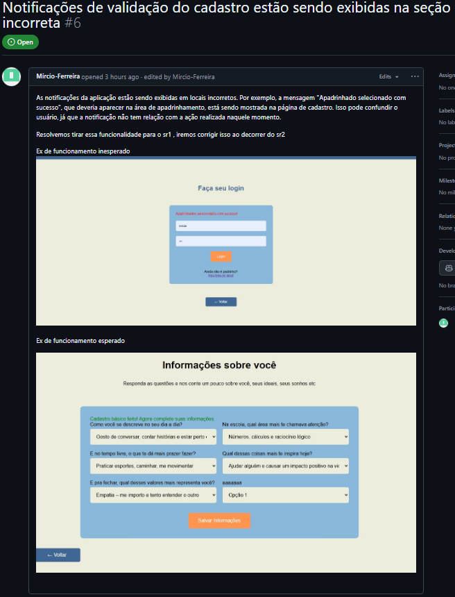

### Bug closed 1:
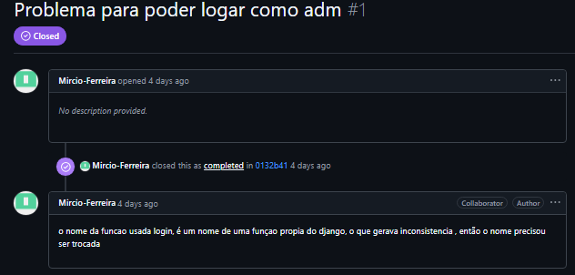

### Bug closed 2:
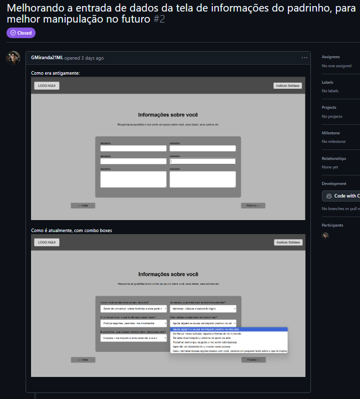

### Bug closed 3:
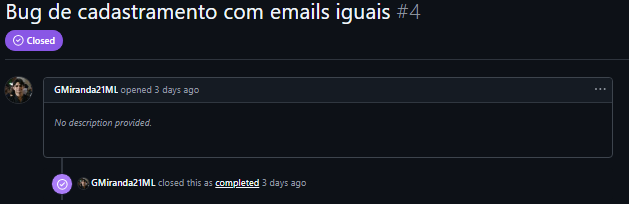

### Bug closed 4:
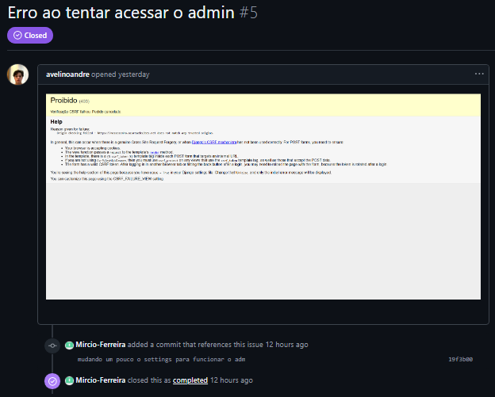

---

<strong>📁 SR2 – Segunda Entrega</strong>

<strong>📜 Histórias de Usuário</strong>

<strong>📌 História 1 - [Título da História]</strong>

**Como** [persona],  
**Quero** [objetivo],  
**Para** [benefício].

#### 🎯 Cenário 1: [Título do Cenário]
- **Dado** que [contexto],  
- **Quando** [ação],  
- **Então** [resultado].

#### ✅ Cenário 2: [Título do Cenário]
- **Dado** que [contexto],  
- **Quando** [ação],  
- **Então** [resultado].

#### ❌ Cenário 3: [Título do Cenário]
- **Dado** que [contexto],  
- **Quando** [ação],  
- **Então** [resultado].

<strong>📌 História 2 - [Título da História]</strong>

**Como** [persona],  
**Quero** [objetivo],  
**Para** [benefício].

#### 🎯 Cenário 1: [Título do Cenário]
- **Dado** que [contexto],  
- **Quando** [ação],  
- **Então** [resultado].

#### ✅ Cenário 2: [Título do Cenário]
- **Dado** que [contexto],  
- **Quando** [ação],  
- **Então** [resultado].

#### ❌ Cenário 3: [Título do Cenário]
- **Dado** que [contexto],  
- **Quando** [ação],  
- **Então** [resultado].

<strong>📌 História 3 - [Título da História]</strong>

**Como** [persona],  
**Quero** [objetivo],  
**Para** [benefício].

#### 🎯 Cenário 1: [Título do Cenário]
- **Dado** que [contexto],  
- **Quando** [ação],  
- **Então** [resultado].

#### ✅ Cenário 2: [Título do Cenário]
- **Dado** que [contexto],  
- **Quando** [ação],  
- **Então** [resultado].

#### ❌ Cenário 3: [Título do Cenário]
- **Dado** que [contexto],  
- **Quando** [ação],  
- **Então** [resultado].

<strong>📌 História 4 - [Título da História]</strong>

**Como** [persona],  
**Quero** [objetivo],  
**Para** [benefício].

#### 🎯 Cenário 1: [Título do Cenário]
- **Dado** que [contexto],  
- **Quando** [ação],  
- **Então** [resultado].

#### ✅ Cenário 2: [Título do Cenário]
- **Dado** que [contexto],  
- **Quando** [ação],  
- **Então** [resultado].

#### ❌ Cenário 3: [Título do Cenário]
- **Dado** que [contexto],  
- **Quando** [ação],  
- **Então** [resultado].

<strong>📌 História 5 - [Título da História]</strong>

**Como** [persona],  
**Quero** [objetivo],  
**Para** [benefício].

#### 🎯 Cenário 1: [Título do Cenário]
- **Dado** que [contexto],  
- **Quando** [ação],  
- **Então** [resultado].

#### ✅ Cenário 2: [Título do Cenário]
- **Dado** que [contexto],  
- **Quando** [ação],  
- **Então** [resultado].

#### ❌ Cenário 3: [Título do Cenário]
- **Dado** que [contexto],  
- **Quando** [ação],  
- **Então** [resultado].

<strong>📌 História 6 - [Título da História]</strong>

**Como** [persona],  
**Quero** [objetivo],  
**Para** [benefício].

#### 🎯 Cenário 1: [Título do Cenário]
- **Dado** que [contexto],  
- **Quando** [ação],  
- **Então** [resultado].

#### ✅ Cenário 2: [Título do Cenário]
- **Dado** que [contexto],  
- **Quando** [ação],  
- **Então** [resultado].

#### ❌ Cenário 3: [Título do Cenário]
- **Dado** que [contexto],  
- **Quando** [ação],  
- **Então** [resultado].

<strong>📌 História 7 - [Título da História]</strong>

**Como** [persona],  
**Quero** [objetivo],  
**Para** [benefício].

#### 🎯 Cenário 1: [Título do Cenário]
- **Dado** que [contexto],  
- **Quando** [ação],  
- **Então** [resultado].

#### ✅ Cenário 2: [Título do Cenário]
- **Dado** que [contexto],  
- **Quando** [ação],  
- **Então** [resultado].

#### ❌ Cenário 3: [Título do Cenário]
- **Dado** que [contexto],  
- **Quando** [ação],  
- **Então** [resultado].

<strong>🔄 Diagrama de Atividade</strong>

### História 1 
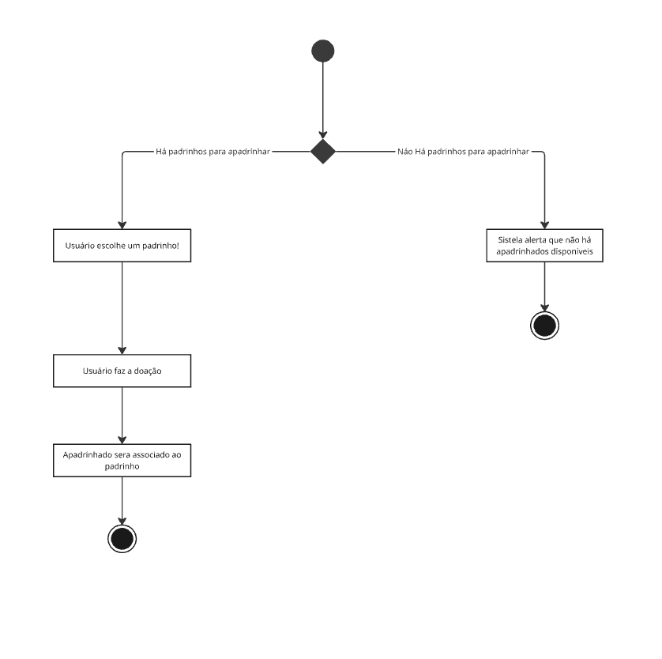

### História 2 

### História 3  
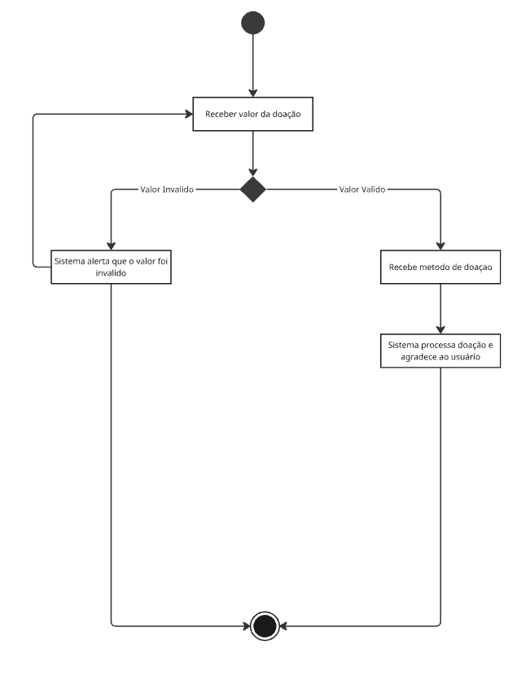

### História 4  
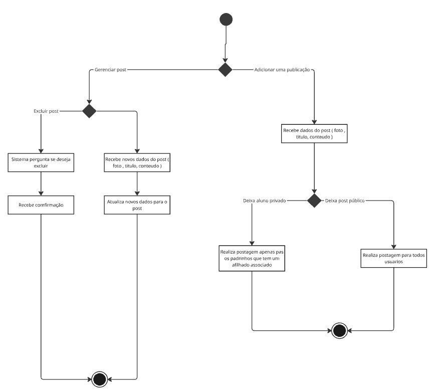

### História 5  

### História 6  
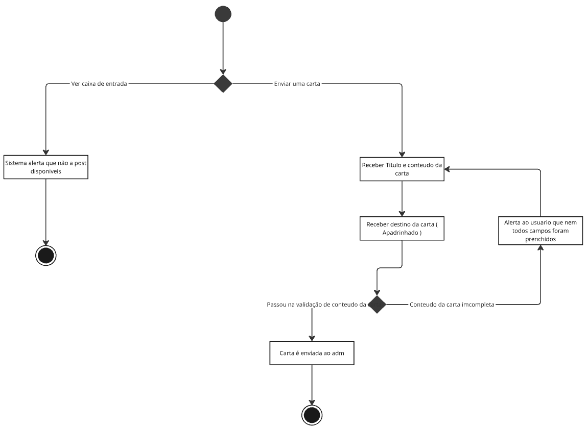

### História 7
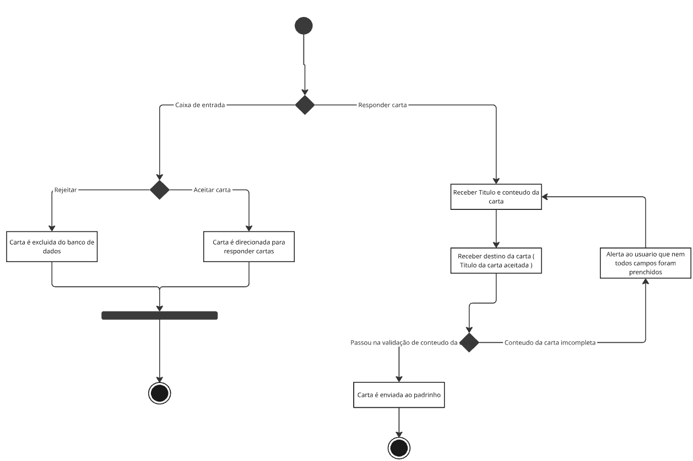

<strong>🖼️ Storyboards</strong>

- Link do docs com as Storyboards:  
  [https://drive.google.com/file/d/1XP1DY3Ywq-NRN-gGRSASNHxE3urc7zLh/view]

<strong>📝 Relatório de Programação</strong>

- Link do docs com o relatório de programação:  
  [https://docs.google.com/document/d/1ZZ6xdAR2GiylmETsNl9Uh1YymUSbXP-ndzaITF-LueI/edit?tab=t.0]

<strong>🚨 Issue / Bug Tracker</strong>

### Bug closed 7:
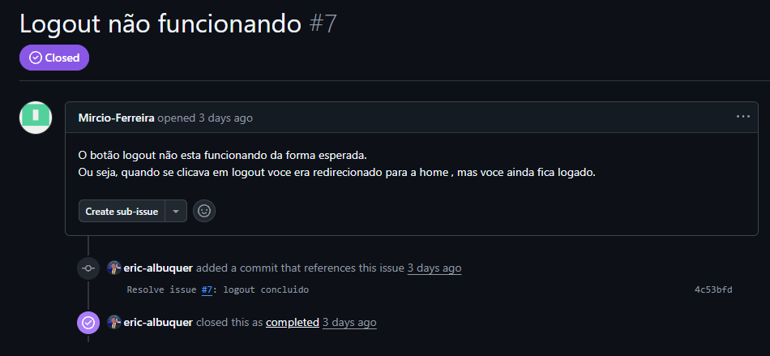

### Bug closed 8:
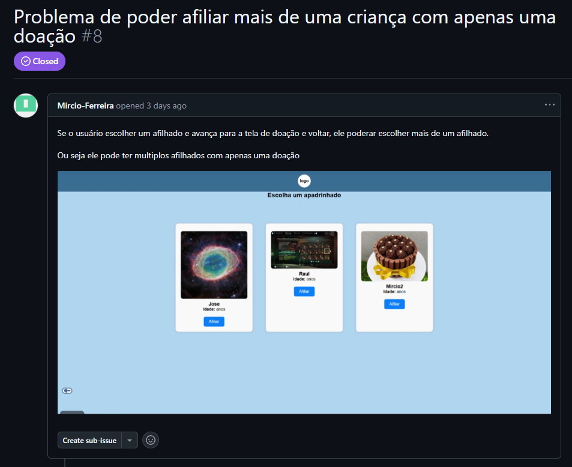

### Bug closed 9:
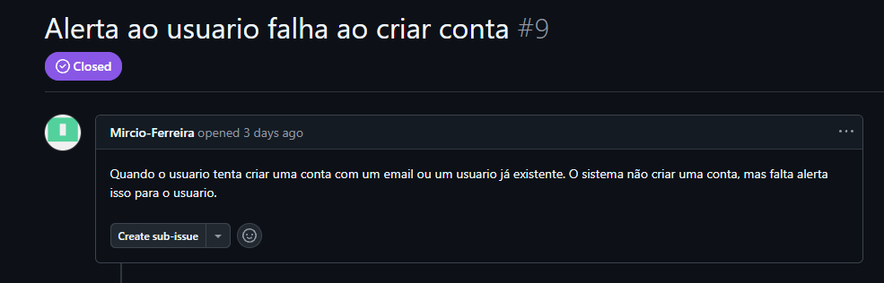

### Bug closed 10:
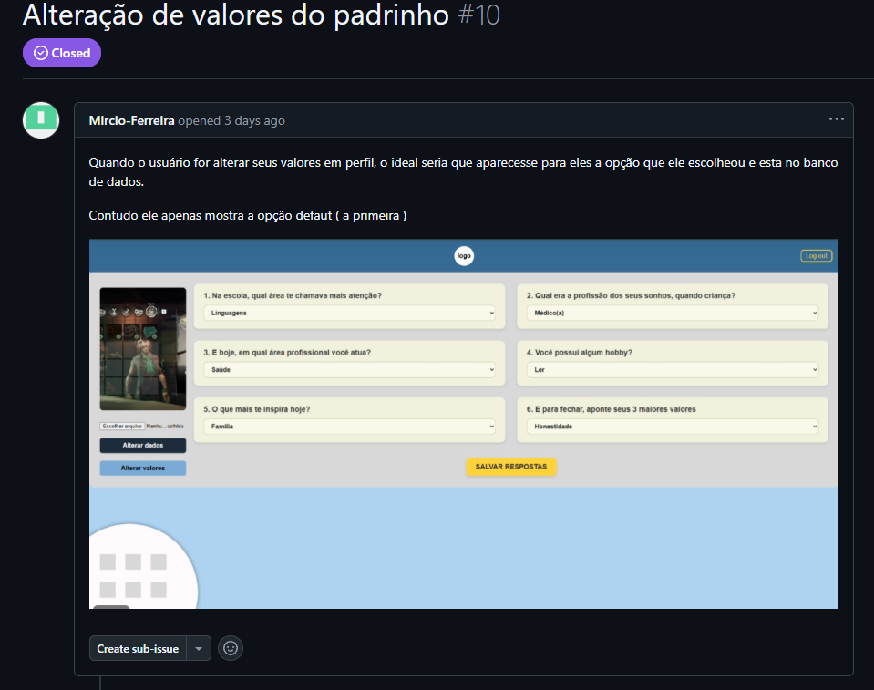

### Bug closed 11:
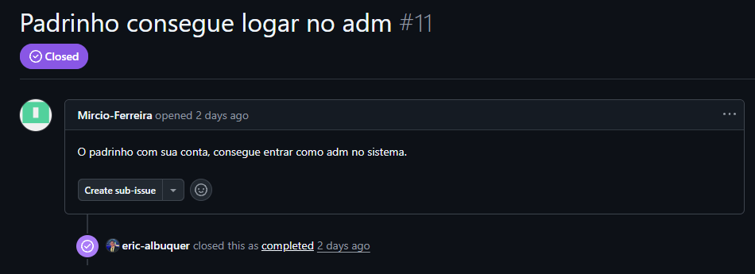

### Bug closed 12:
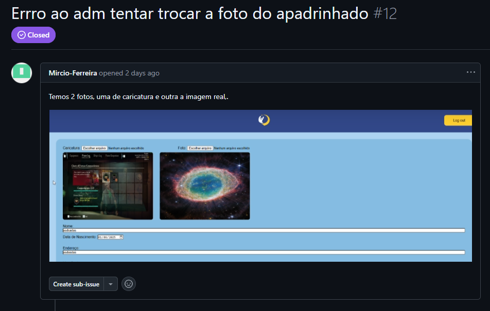

### Bug closed 14:
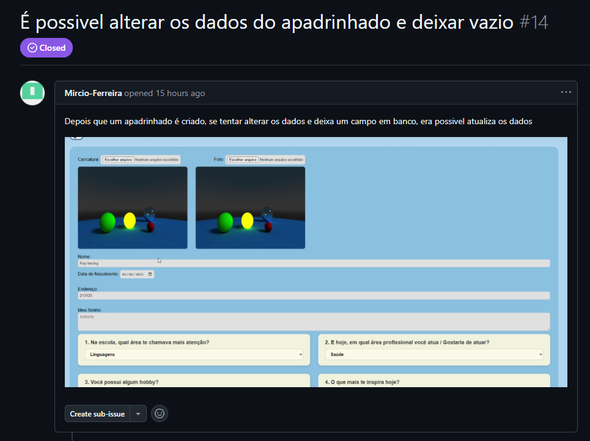

<strong>🎥 Screenquest</strong>

<strong>????</strong>

